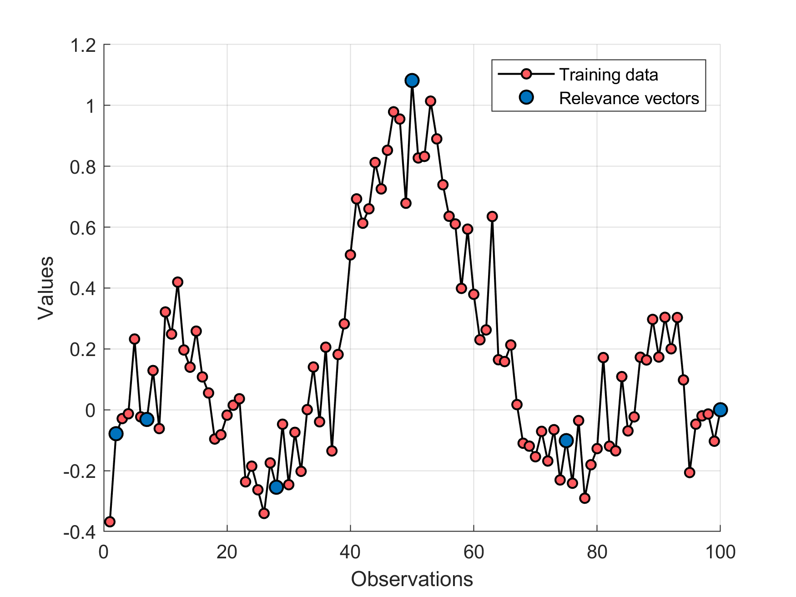
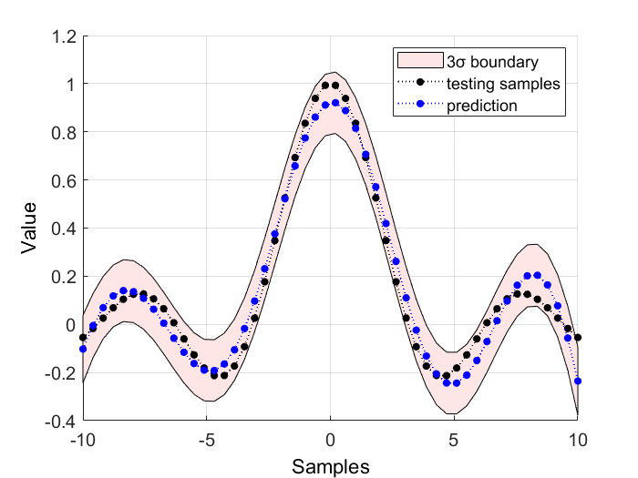

# Relevance-Vector-Machine

## Prediction based on Relevance Vector Machine (RVM), SB2_Release_200

---------------------------------------------------------
Updated on 11 May 2019	
1. Fixed some errors 
2. Optimized the code
3. Modified the function 'SparseBayes.m'
---------------------------------------------------------  

## demo: prediction for a numerical example by using RVM
```
clc
clear all
close all
addpath(genpath(pwd))

% sinc funciton
fun = @(x) sin(abs(x))/abs(x);

% training samples
x = linspace(-10,10,100);
y = arrayfun(fun,x);
Xtrain = x';
Ytrain = y';

% testing samples
xtest = linspace(-10,10,30);
ytest = arrayfun(fun,xtest);
Xtest = xtest';
Ytest = ytest';

% Train RVM model
model = rvm_train(Xtrain,Ytrain,'sigma',5.5,'bias',1);

% Test RVM model
[y_mu,y_var] = rvm_test(model,Xtest);

% Plot the training results 
plottrainingResult(Xtrain,Ytrain,model)

% Plot the testing results 
plottestingResult(Xtest,Ytest,y_mu,y_var)
```

  
  
